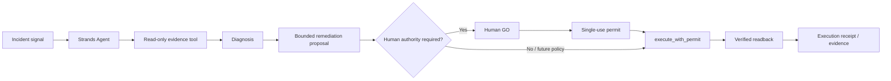

# Architecture

## Authority boundary

Strands can investigate, reason, and call tools. It cannot issue its own approval permit.
The Human GO path exists outside the model's registered tools.

## Current 0A runtime

The first slice uses an in-memory synthetic incident runtime. This isolates governance semantics and makes replay/drift behavior deterministic. A later milestone may bind the same contract to AWS/AgentCore after explicit review.
